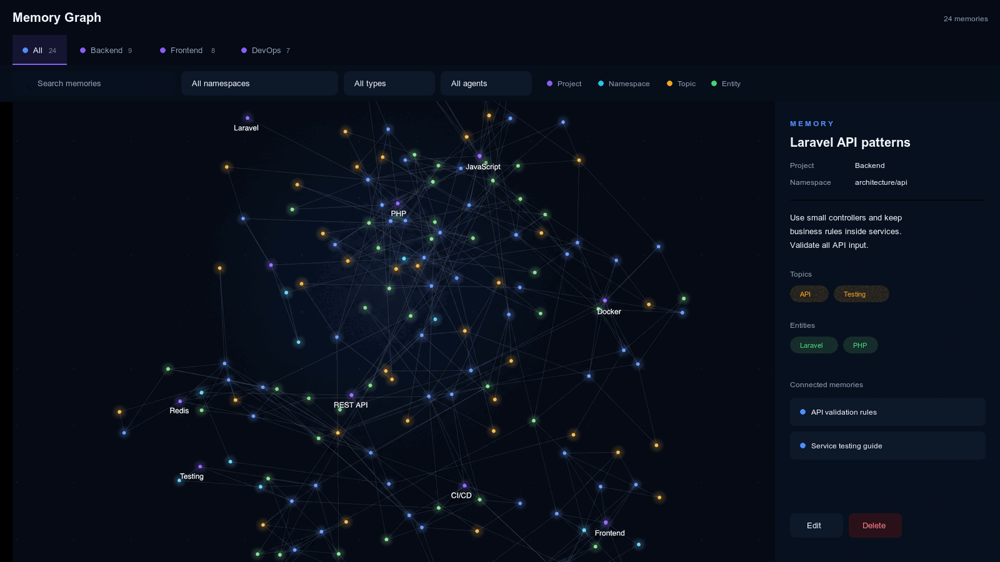

# Getting Started

## Installation

First, you'll need to download this repository. After you've downloaded it, you can install and run the servers.

This project uses [uv](https://github.com/astral-sh/uv) for dependency management.

1. Install uv:

```bash
pip install uv
```

2. Install the package and required dependencies:

```bash
uv sync
```

3. Set up environment variables (see [Configuration](configuration.md) section)

## Running

The easiest way to start the worker, REST API server, and MCP server is to use Docker Compose. See the Docker Compose section below for more details.

For the managed Mac setup, run `./ams docker:install` from the repository root.
It runs the first setup when needed, builds the current source, and replaces
the app containers while keeping the Redis memory database. The safe start,
restart, and reset commands are listed in the
[local install guide](../../INSTALL.md#run-the-current-source-in-docker).
The same guide has [simple agent prompts and Codex checks](../../INSTALL.md#use-shared-memory-in-agent-tasks)
for saving, recalling, and automatically using project memory.

But you can also run these components via the CLI commands. Here's how you
run the REST API server:

```bash
# Development mode (no separate worker needed, asyncio backend)
uv run agent-memory api --task-backend asyncio

# Production mode (default Docket backend; requires separate worker process)
uv run agent-memory api
```

Or the MCP server:

```bash
# Stdio mode (recommended for Claude Desktop)
uv run agent-memory mcp

# SSE mode for development
uv run agent-memory mcp --mode sse

# Streamable HTTP mode for network deployments
uv run agent-memory mcp --mode streamable-http --port 9000

# SSE mode for production (use Docket backend)
uv run agent-memory mcp --mode sse --task-backend docket
```

### Review memories in the graph

After the API starts, open
[http://127.0.0.1:8000/admin/memories/graph](http://127.0.0.1:8000/admin/memories/graph).

The page can filter by project, namespace, memory type, and agent. Drag to move
around, scroll to zoom, and click a node to read or edit the full memory.
Project, namespace, topic, and entity details include links to the memories
connected to that node. Topic and Entity tags in a memory panel jump to the
matching node. Larger nodes have more links or longer memory text.
Coloured halos make node groups easier to see.
Browsing uses filter and keyword searches only, so it does not call an AI
model. Saving an edit rebuilds the memory's search embedding and may use the
configured embedding provider.

The graph silently checks for changes every 10 seconds. A new memory appears
without a page reload and briefly shows a ripple around its node. Your zoom,
position, filters, and selected memory stay in place. Refreshes pause while you
search, drag, edit, or confirm a deletion. A failed check leaves the current
graph untouched.



_Example only: every label, memory and count in this image is made up._

Use **Delete** in a memory panel to remove that memory. The page asks for
confirmation first. Deletion cannot be undone, still works for pinned memories,
and does not delete related memories or use AI credits.

The built-in graph is for local use. The local Docker quickstart sets
`DISABLE_AUTH=true` and binds the service to the current Mac only. Do not expose
that setup to a network. With API authentication enabled, the graph page and
data also require authentication, but the page has no sign-in screen. A shared
deployment needs a trusted web proxy or another browser login layer that sends
the supported bearer token. Give delete access only to trusted users.

### Core CLI Commands

| Command | Typical Use | Backend Behavior |
|---|---|---|
| `uv run agent-memory api --task-backend=asyncio` | Local development (single process) | Uses `asyncio` inline tasks; no separate worker |
| `uv run agent-memory api` | Production API server | Defaults to `docket`; run `uv run agent-memory task-worker` |
| `uv run agent-memory mcp` | Claude Desktop / local stdio MCP | Defaults to `asyncio`; no worker required |
| `uv run agent-memory mcp --mode sse --port 9000 --task-backend docket` | Network MCP with shared workers | Uses `docket`; run `uv run agent-memory task-worker` |
| `uv run agent-memory task-worker --concurrency 10` | Background processing | Processes queued Docket tasks |

### Using uvx in MCP clients

When configuring MCP-enabled apps (e.g., Claude Desktop), prefer `uvx` so the app can run the server without a local checkout:

```json
{
  "mcpServers": {
    "memory": {
      "command": "uvx",
      "args": ["--from", "agent-memory-server", "agent-memory", "mcp"],
      "env": {
        "DISABLE_AUTH": "true",
        "REDIS_URL": "redis://localhost:6379",
        "OPENAI_API_KEY": "<your-openai-key>"
      }
    }
  }
}
```

Notes:
- API keys: Default models use OpenAI. Set `OPENAI_API_KEY`. To use Anthropic instead, set `ANTHROPIC_API_KEY` and also `GENERATION_MODEL` to an Anthropic model (e.g., `claude-3-5-haiku-20241022`). If you have access to GPT-5 models, you can instead set `GENERATION_MODEL` to `gpt-5.2-chat-latest`, `gpt-5.1-chat-latest`, `gpt-5-mini`, or `gpt-5-nano`. See [LLM Providers](llm-providers.md) for all supported providers.
- Make sure your MCP host can find `uvx` (on its PATH or by using an absolute command path). macOS: `brew install uv`. If not on PATH, set `"command"` to an absolute path (e.g., `/opt/homebrew/bin/uvx` on Apple Silicon, `/usr/local/bin/uvx` on Intel macOS).
- For production, remove `DISABLE_AUTH` and configure auth.


**For production deployments**, you'll need to run a separate worker process:

```bash
uv run agent-memory task-worker
```

**For development**, the default `--task-backend=asyncio` on the `mcp` command runs tasks inline without needing a separate worker process. For the `api` command, use `--task-backend=asyncio` explicitly when you want single-process behavior.

**NOTE:** With uv, prefix the command with `uv`, e.g.: `uv run agent-memory mcp --mode sse`. If you installed from source, you'll probably need to add `--directory` to tell uv where to find the code: `uv --directory <path/to/checkout> run agent-memory mcp --mode stdio`.

## Docker Compose

To start the API using Docker Compose, follow these steps:

1. Ensure that Docker and Docker Compose are installed on your system.

2. Open a terminal in the project root directory (where the `docker-compose.yml` file is located).

3. (Optional) Set up your environment variables (such as `OPENAI_API_KEY` and `ANTHROPIC_API_KEY`) either in a `.env` file or by modifying `docker-compose.yml` as needed.

4. Build and start the containers by running:
   ```bash
   docker compose up --build
   ```

5. Once the containers are up, the REST API will be available at http://localhost:8000. You can also access the interactive API documentation at http://localhost:8000/docs. The MCP server will be available at http://localhost:9050/sse.

   Note: In Docker Compose, MCP is mapped as `9050:9000`, so you connect to port `9050` on the host. If you run MCP directly via CLI (without Compose), the default port is `9000`.

6. To stop the containers, press Ctrl+C in the terminal and then run:
   ```bash
   docker compose down
   ```
